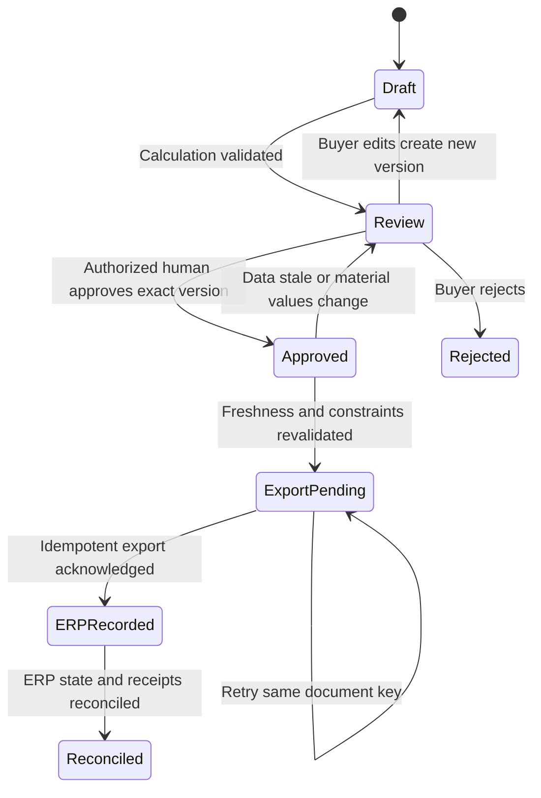

# Elektrokomplekt replenishment decision platform

Architecture, data contracts, delivery roadmap, and competition strategy. Prepared for HackAlem AI on 23 September 2026. This is a proposed system design; no replenishment algorithm or live ERP integration has been implemented.

## 1. Enterprise-grade scalable system architecture

### 1.1 Recommended design and evidence boundary

Build a **buyer-controlled replenishment platform** that converts auditable demand estimates into feasible supplier purchase proposals. Keep demand correction, forecasting, inventory policy, constrained optimization, and approval as separate domain components. Deploy them as a modular application for the hackathon; extract worker services when throughput, ownership, or isolation requires it.

The linked [case brief](https://docs.google.com/document/d/1Z4faOPlT1t6NMCuJSKKB8-vkZ2LVzGMR0PO9rtZgSnM/preview?tab=t.0) specifies five acceptance checks: source-sensitive calculation, seasonality/growth, lost-demand compensation, resistance to large one-off sales, and explained supplier-grouped proposals. This design also treats the user's MOQ, pack-multiple, dynamic safety-stock, and ROP requirements as mandatory in Phase 1. Source-document instructions are evidence about the case, not authorization to send orders or change external systems.

**What the supplied files establish:**

| Evidence from the 12 workbooks | Architectural implication |
|---|---|
| Approximately 249,000 populated rows in the two sales-dynamics exports; fields are date, document number/type, SKU code/name, UOM, warehouse, and quantity. Some dates are in 2023 despite the filenames. | Parse actual dates and document semantics. Do not infer coverage from filenames or treat all document rows as fulfilled demand. |
| Sales quantities include both signs; document types include customer orders and receipts as well as sales invoices. All SKU-bearing transaction rows inspected are labelled Алматы. | Classify movement types before aggregating. Do not take absolute values or count customer orders and their fulfilments twice. Multi-warehouse behavior needs additional data or synthetic fixtures. |
| Customer identifiers and transaction prices are absent from those exports. | Invoice-level spike detection is possible; repeated-order concentration by customer and transaction-level margin analysis require additional ERP data. |
| Monthly sales and balance reports run from January 2024 through September 2026. IEK balance headers explicitly say opening balance. | September is an incomplete period at the source cut-off. Monthly observations cannot prove daily stockout intervals or current inventory. Never sum stock snapshots over time. |
| IEK transit columns contain PO references and expected arrival deadlines. Product descriptions explicitly distinguish coils purchased from metres recorded. | Unpivot to dated PO lines; retain ETA semantics and purchase-to-base UOM conversions. |
| Systeme's transit workbook also contains stock, reserved/free stock, category, growth/seasonality fields, a cost-like field, and a weight header. | These are useful mapping candidates, not automatically authoritative definitions. Reconcile overlapping stock columns; verify cost/currency and usable weight values. |
| IEK's constraint column is “minimum allowed shipment”; Systeme's is “multiple.” IEK has 1,938 keyed rows, 1,937 distinct keys, and 15 `#N/A` constraint values. | MOQ and order multiple are separate fields. Validate duplicates and source precedence; never silently replace unresolved constraints with 1. |

Exact stockout logs, reliable current stock across the full assortment, customer pseudonyms, complete lead-time/pack data, and logistics dimensions are **not established by these exports**. Use visibly labelled synthetic fixtures for absent must-have inputs, as permitted by the case brief. Production approval is blocked for affected lines until required operational inputs are verified. See [source-data-assessment.md](/Users/senynmaman/hack-20ebc90b-codex-monsters/docs/source-data-assessment.md) for workbook locations and inspected ranges.

### 1.2 End-to-end logical architecture

```mermaid
flowchart LR
    ERP["1C: sales, stock, reservations, PO receipts"] --> ING["Ingestion adapters\nREST, webhooks, file exchange"]
    FILES["IEK / Systeme XLSX\nSupplier terms and planning inputs"] --> ING
    ING --> RAW["Immutable raw storage\nChecksums and source manifests"]
    RAW --> DQ["Validation and normalization\nSKU, UOM, dates, deduplication"]
    DQ -->|invalid or ambiguous| QUAR["Quarantine and data-owner review"]
    DQ --> STORE["Canonical analytical tables\nPoint-in-time feature snapshots"]
    STORE --> ANOM["Outlier classification"]
    ANOM -->|regular channel| REC["Censored-demand recovery"]
    ANOM -->|project channel| PROJ["Project demand and reserved buffer"]
    REC --> FC["Probabilistic forecasting\nSeasonality, trend, change points"]
    FC --> POL["Inventory policy\nSafety stock, ROP, target stock"]
    STORE -->|stock, terms, pipeline| POL
    POL --> OPT["OR optimization\nBudget, MOQ, packs, loads"]
    PROJ --> OPT
    OPT --> PROP["Versioned proposals\nDecision ledger and XAI"]
    PROP --> UI["FastAPI and buyer UI\nReview, edit, simulate"]
    UI --> APPROVE["Authenticated approval\nFreshness and constraint validation"]
    APPROVE --> OUTBOX["Transactional outbox\nApproved document only"]
    OUTBOX --> ERP
    ERP -->|PO identifiers, status, receipts| ING
    UI --> SIM["Isolated scenario jobs"]
    SIM --> OPT
```

The platform creates **recommendations**. Only the approval/export service can create an approved ERP purchase document; forecasting and optimization workers have no vendor-transmission credentials. Supplier release remains inside the controlled ERP procurement workflow, with confirmation required before any external transmission.

### 1.3 Component responsibilities and interfaces

| Component | Owns | Emits | Boundary |
|---|---|---|---|
| Ingestion/ETL | Source extraction, raw provenance, mappings, quality checks | Versioned canonical snapshots and validation reports | Does not infer demand or approve business decisions. |
| Outlier classifier | Document/customer concentration, SKU-relative event size, recurrence, project evidence | Regular/project/uncertain allocations with reason codes | Preserves original sales; classification is reversible. |
| Demand recovery | Availability masks, partial exposure, latent regular demand and uncertainty | Corrected-demand distribution and confidence | Never treats inferred demand as measured ground truth. |
| Forecast service | Seasonality, level changes, category growth, intermittent-demand routing | Mean/quantiles and joint demand paths | Does not know MOQ or determine purchase quantities. |
| Inventory-policy service | Service metric, review calendar, protection period, net commitments | Safety stock, ROP, target inventory, unconstrained need | Does not claim budget feasibility. |
| OR service | Feasible pack/order decisions and supplier-level coupling | Chosen quantities, costs, constraints, solution status | Does not rewrite the forecast to fit the budget. |
| Proposal/approval service | Versions, buyer changes, authorization, signed decision evidence | Approved ERP documents and audit events | Cannot approve a stale or changed proposal version. |
| Scenario/evaluation service | Isolated what-if runs and temporal replay | Comparable forecast, service, cost and inventory outcomes | Cannot release orders. |

Use an offline feature store first: versioned Parquet/SQL feature tables keyed by SKU, warehouse, period, and information cut-off. Add an online feature cache only for a measured latency need. Live inventory belongs in the operational state store, not solely in a model feature store.

### 1.4 Decision logic at the service boundaries

**Outliers.** Start with robust SKU-relative event-size rules, document concentration, and recurrence checks; use category priors for sparse SKUs. A large observation is a candidate, not proof of a project. Distinguish one-off projects from promotions, returns, recurring wholesale demand, and genuine baseline shifts. Store a buyer-overridable label with confidence. Known committed projects create dated project requirements and reserved supply. An isolated historical project does not automatically create a standing replenishment buffer.

**Lost demand.** Model fulfilled sales as a censored observation when stock is unavailable. Estimate regular demand from comparable in-stock periods and pooled category patterns. Preserve observed regular sales and add a nonnegative missing-demand estimate only over the unavailable exposure. Partial-day stockouts require operating-hour exposure; zero sales while in stock remain genuine zeros. Monthly opening balances provide an uncertainty flag, not an exact stockout interval. Report low/base/high recovered demand when evidence is weak. Propagate this uncertainty to forecast paths and safety stock.

**Forecasting.** Phase 1 uses transparent seasonal/category factors, a recent robust level and a bounded growth term, with intermittent-demand and cold-start fallbacks. Later candidates include ETS, intermittent-demand methods and global quantile models. Choose by rolling-origin results and inventory outcomes, not model complexity. Growth overrides must identify whether they replace or increment the learned trend; never multiply two versions of the same growth estimate. Incomplete September and future blank/zero months must not become full-month negative demand signals. Supplier-level seasonality reports may reflect price/mix changes; verify their measure before applying them to SKU unit forecasts.

**Inventory policy.** Let L be replenishment lead time, R the supplier review interval, and D(H) uncertain regular demand over protection period H. For a continuous-review approximation, H=L. For periodic review, H=L+R. All dates include the agreed supplier dispatch calendar and warehouse receiving calendar.

- Cycle-service target alpha: target stock `S(H) = quantile_alpha[D(H)]`.
- Dynamic safety stock: `SS(H) = max(0, S(H) - E[D(H)])`.
- Continuous-review ROP: `ROP = E[D(L)] + SS(L)`.
- Periodic-review order-up-to target: `S(L+R)`; replenish on the scheduled review date. Display the lead-time ROP as a risk indicator without mixing it with the periodic policy's order rule.

Define net available stock as on-hand minus blocked stock minus reservations. Add eligible dated receipts and subtract **only commitments not already deducted or represented in the residual forecast**. Netted demand and reservation provenance prevent subtracting the same customer order twice. Keep project allocations out of regular available supply. For a simple feasible horizon, `Q_raw = max(0, S(H) - inventory_position(H))`; the production engine evaluates dated balance trajectories because a receipt after a stockout does not prevent that earlier shortage.

If Q_raw is positive and m is the pack increment in the same base UOM, the unconstrained rounded candidate is `m * ceil(max(Q_raw, MOQ) / m)`. Zero need stays zero unless the OR engine explicitly chooses an economic top-up. MOQ is a lower bound for a positive order; pack multiple is an increment. Convert metre/coil, piece/box and pallet quantities before applying either rule. Run the budget/load checks after rounding.

Do not sum marginal daily quantiles to obtain a lead-time quantile. Aggregate joint demand paths, including serial correlation, imputation uncertainty, and sampled lead times, then take a quantile. A normal approximation is only a documented fallback with validated assumptions. A 95% cycle-service target is not a 95% unit fill-rate target; fill-rate targeting needs an expected-shortage calculation or simulation.

**Optimization.** Minimize expected holding, shortage, ordering and freight/expediting costs over a stated horizon; add purchase cash requirements and terminal inventory treatment consistently. Use landed cost for capital constraints. Avoid counting the same loss both as lost contribution margin and a duplicate shortage penalty. Decision variables are integer pack quantities, supplier order activation, and optionally transport assignments. Hard constraints include valid UOM conversions, MOQ/multiples, budget, warehouse capacity, supplier terms and truck payload/volume. Service targets can be hard or penalized according to an explicit policy. If constraints conflict, return an infeasibility report and a shortage-risk trade-off; never silently violate budget or pack rules.

### 1.5 Evolution from MVP to production

| Concern | Phase 1: hackathon | Phase 2: near-production | Phase 3: enterprise |
|---|---|---|---|
| API/UI | FastAPI + Streamlit | FastAPI + buyer web UI/SSO | Stateless replicated APIs, tenant/warehouse scope |
| Operational state | SQLite, one writer | PostgreSQL transactions | PostgreSQL HA and bounded partitioning/read replicas |
| Analytics | DuckDB + Parquet; Pandas for bounded imports | Object storage + Parquet; PostgreSQL or ClickHouse according to measured scans | Partitioned ClickHouse/warehouse and durable object storage |
| Execution | Explicit stages in one application + background worker | Celery workers for jobs; Redis cache; durable task broker | Separate forecast, optimization and simulation pools on Kubernetes |
| Orchestration | Run manifest and simple scheduling | Airflow for dependency/backfill DAGs; Celery for execution | Queue isolation, autoscaling and resource quotas |
| Optimization | Deterministic policy + feasible greedy budget/pack allocation | Bounded MILP/CP-SAT and heuristic fallback | Decomposed network optimization and coordinated budget allocation |
| Deployment | Reproducible Docker image/Compose | CI/CD, staging, registry, migration tests | Kubernetes rollout controls, HA, disaster recovery |
| Models | Versioned parameters and persisted baseline artifacts | Registry, tuning, temporal backtests, champion/challenger | Drift-triggered candidate retraining and governed promotion |

These technologies have different roles: SQLite/PostgreSQL protect approval transactions; DuckDB/ClickHouse scan analytical data. Airflow schedules dependent workflows; Celery runs tasks. Redis is a cache/short-lived coordination layer, never the sole approval ledger. A durable broker plus database job/outbox records supports retries. Do not put a shared writable DuckDB or SQLite file behind horizontally scaled API pods.

**Scaling rules.** Partition raw facts by organization/date and analytical series by SKU/warehouse. Forecast by SKU batches, not one process per SKU. Optimize by supplier, receiving warehouse and delivery window. A global working-capital coordinator allocates quotas to subproblems and reconciles them; independent supplier workers cannot all consume the same budget. MEIO introduces network coupling and needs a coordinated solve. Use CPU/memory-bounded worker queues, backpressure, incremental recomputation and warm model artifacts. Queue messages carry snapshot/object references rather than million-row payloads.

**Reliability and governance.** Use immutable input manifests, source watermarks, model/policy versions and deterministic seeds per run. Publish results atomically only after all mandatory stages validate. Record at-least-once delivery with idempotent consumers, unique document keys and an outbox; do not promise distributed exactly-once execution. Retry transient errors with backoff, quarantine poison records, and surface failed jobs. On an ERP outage, display drafts with their data age and block approval/export when freshness expires. Support buyer-approved baseline fallback when ML fails and a feasible heuristic when the solver times out; label fallback and optimality status.

Use RBAC for viewer/planner/approver/admin, separation of duties above configurable spending thresholds, encryption, managed secrets, pseudonymized customer keys, append-only approval history and tested backups. Monitor feed lag, rejected records, forecast drift/bias, constraint violations, solver gaps, queue latency, approval age and ERP reconciliation. Example Phase 2 acceptance targets are p95 cached UI reads under 2 seconds, stock lag under 15 minutes, daily planning within 30 minutes for the benchmark scope, API availability 99.5%, RPO 15 minutes and RTO 4 hours. These are proposed targets to load-test and agree, not measured performance or vendor guarantees.

### 1.6 Bidirectional 1C integration and approval

Use an anti-corruption adapter between the canonical contracts and the installed 1C configuration. 1C supports automatically generated REST interfaces and custom HTTP services; the exact document names, posting rules and extension options must be mapped in the partner's environment. See [1C HTTP-service documentation](https://v8.1c.ru/platforma/http-servisy/).

| Direction | Mechanism | Required behavior |
|---|---|---|
| 1C to platform | Incremental REST/OData reads; periodic full reconciliation | Read sales/returns, current stock, reservations, suppliers, PO lines and receipts using stable IDs and modification watermarks. |
| 1C to platform events | Extension/change register + adapter webhook or integration bus | Treat webhook delivery as at-least-once; authenticate, replay-protect, deduplicate and fetch authoritative details. Do not assume webhooks exist in the current configuration. |
| Platform to 1C | Custom HTTP command accepting an approved proposal version | Create a supplier-order document once, return its GUID/number/status, and respect 1C business validation and authorization. |
| File fallback | Versioned UTF-8 CSV/XLSX for buyer review; agreed JSON/XML/XDTO exchange | Fixed identifiers, UOM, decimals, currency, timestamps, checksum and manifest. CommerceML or another format only if the selected 1C objects and configuration support the required mapping. |
| Reconciliation | PO status, cancellation and actual receipt callbacks/polls | Update pipeline quantities and empirical lead times; distinguish accepted ERP document from received goods. |

An approval binds user, timestamp, proposal version, input snapshot, policy version and content hash. Before export, recheck stock, open POs, prices/terms, budget and permissions. A material change creates a new proposal version and requires approval again. Keep the approved version immutable; cancellation/amendment uses a linked revision. Invalidate only by recorded state transition, not by silently modifying signed content.

## 2. Implementation roadmap and data contracts

### 2.1 Phases and Definition of Done

Durations below are planning assumptions for a small cross-functional team with data-owner access; ERP discovery can change them.

| Phase | Deliverables and sequence | Definition of Done |
|---|---|---|
| **1: hackathon, 48–72 hours** | 0–12h: profile all sources, map IDs/UOM, create canonical fixtures. 12–30h: outlier/recovery/seasonality/growth pipeline and uncertainty fallback. 30–48h: safety stock, ROP, MOQ/pack logic, supplier grouping and explanations. 48–72h: buyer workflow, export, test evidence, demo and README. | All five case checks and user-added inventory constraints pass deterministic fixtures; every proposal unit reconciles to its decision ledger; outputs are reproducible; edits/approvals are versioned; unapproved vendor transmission is impossible; provided exports run with visible data gaps; synthetic rows never mix silently with real evidence. |
| **2: near-production, 4–6 weeks** | ERP adapter in sandbox; complete missing contracts; rolling-origin backtesting and bounded tuning; global/intermittent model candidates; solver; operational monitoring; SSO/RBAC; load and failure testing; shadow operation. | Signed source definitions; end-to-end contract tests; all buyer/ERP retry paths tested; 10-million-row benchmark meets agreed targets on documented hardware; champion beats or matches approved baseline on service-cost criteria; 2–4 weeks of shadow review; restore exercise meets RPO/RTO; business and security owners approve pilot. |
| **3: full enterprise, 8–12 additional weeks** | Empirical lane-specific lead-time distributions, supplier reliability, MEIO, transfer recommendations, network capacity and capital coordination, multi-site rollout. | Multi-echelon simulator balances every physical movement; transfers include transit time/cost and approval; constrained pilot shows credible benefit without unacceptable service deterioration; budgets remain global; failover, scale and rollback are exercised. |

Suggested ownership: data engineer + ERP analyst own ingestion/contracts; ML lead owns demand correction/forecasting; OR/backend lead owns policy/optimization; product/frontend lead owns buyer workflow; procurement owner signs business semantics and acceptance. One person may cover several roles in the hackathon.

**Phase 1 judge validation matrix:**

| Requirement | Controlled test and acceptance condition |
|---|---|
| All supplied inputs influence calculation | Perturb sales, stock, pipeline timing/quantity, category, growth and supplier terms individually. In an unconstrained fixture chosen away from rounding boundaries, each relevant change affects the intermediate need or final quantity in the expected direction. Real capped/rounded orders may stay unchanged, with the binding constraint explained. |
| Seasonality and durable growth | A known seasonal fixture peaks in the correct horizon; sustained growth changes level/trend. An isolated spike does not become a permanent trend. |
| Lost-demand recovery | With a known stockout and positive latent demand, corrected demand exceeds recorded sales and raises unconstrained need. In-stock zero-demand controls remain zero. |
| One-off B2B resistance | Inject a labelled one-time 100x project event; deterministic routing leaves regular demand/need unchanged and preserves the project record. Split the event across invoices for one pseudonymous customer to test customer concentration. Measure separate precision/recall on ambiguous cases. |
| Supplier-grouped XAI | Every SKU has supplier, quantity, UOM, urgency, input/model versions and an arithmetic explanation; supplier totals equal their lines. |
| MOQ and pack multiples | Zero need remains zero; positive proposals meet MOQ and allowed increments after UOM conversion; incompatible/missing terms produce an explicit exception. |
| Human validation | Unapproved export rejected; a post-approval edit invalidates approval; duplicate export creates one ERP document; stale stock forces review. |

“100% baseline coverage” means every mandatory behavior is implemented and tested. It does not mean missing customer or stockout data has been measured. Demonstrate these paths with identified synthetic fixtures and keep production readiness a separate gate.

### 2.2 Contract conventions

All schemas are versioned. The tables below define required fields unless marked `?` (nullable). `ID` is a nonempty string; preserve leading zeros, Cyrillic and suffixes. `Q` is decimal(20,6) base-UOM quantity; `M` is decimal(20,4) money. JSON encodes decimals as strings. `TS` is an RFC3339 timestamp stored in UTC; retain source timezone and derive business dates using Asia/Almaty. `D` is an ISO date. Intervals are `[start,end)`; a null stockout end means ongoing. Ratios are dimensionless; pack, volume, weight and currency units are explicit.

Every canonical input record carries `schema_version`, `record_id`, `source_system`, `source_ref`, `source_version`, `observed_at:TS`, `ingested_at:TS`, `provenance:enum(observed,derived,synthetic,override)`. A manifest supplies organization, source timezone, extraction cut-off, file/object checksum, schema mapping version and coverage. Never interpret null as zero.

### 2.3 Precise input contracts

| Contract / grain / owner | Required payload | Validation and missing-data behavior |
|---|---|---|
| `sku_master.v1` / SKU / master-data owner | `sku_id:ID`, `category_id:ID`, `base_uom:ID`, `quantity_quantum:Q`, `lifecycle:active|new|discontinued`, `effective_from:D`, `effective_to:D?` | Quantum positive; effective versions do not overlap. Do not infer category semantics from code prefixes without a dictionary. |
| `supplier_sku.v1` / supplier × SKU × validity / procurement | `supplier_id:ID`, `sku_id:ID`, `supplier_article:ID`, `purchase_uom:ID`, `base_units_per_purchase_uom:Q`, `moq_purchase_qty:Q`, `order_multiple_purchase_qty:Q`, `effective_from:D`, `effective_to:D?` | Positive conversion/multiple, nonnegative MOQ; multiple and MOQ remain distinct; conflicts quarantined. Separate dimensional/pallet metadata as needed. |
| `sales_event.v1` / ERP document line revision / ERP owner | `erp_doc_id:ID`, `erp_line_id:ID`, `revision:int`, `sku_id:ID`, `warehouse_id:ID`, `event_at:TS`, `event_type:sale|return|correction|cancel`, `quantity_base:Q`, `demand_effect:increase|decrease|none`, `customer_token:ID?`, `project_id:ID?`, `original_line_id:ID?`, `unit_net_price:M?`, `currency:ID?`, `posting_state:posted|reversed` | Quantity is a nonnegative magnitude with event-type semantics; correction direction is explicit. Returns reference original sales when possible. Customer token required for customer-aware acceptance; price/currency required for price/margin analytics. Source signed quantity is preserved in raw data. |
| `inventory_snapshot.v1` / warehouse × SKU × timestamp / warehouse owner | `snapshot_id:ID`, `sku_id:ID`, `warehouse_id:ID`, `as_of:TS`, `on_hand_base:Q`, `reserved_base:Q`, `blocked_base:Q`, `free_base:Q`, `source_revision:ID` | Reconcile free stock to agreed accounting definition; classify overlaps among reserved/blocked stock. Enforce age limit at approval. Negative or inconsistent values require an explicit business interpretation. |
| `stockout_interval.v1` / warehouse × SKU × unavailable interval / warehouse owner | `sku_id:ID`, `warehouse_id:ID`, `start_at:TS`, `end_at:TS?`, `unavailable_fraction:decimal[0,1]`, `evidence:event_log|movement_reconstruction|inferred`, `confidence:decimal[0,1]` | End after start; normalize overlaps against operating calendar. Monthly balances cannot populate observed daily intervals. |
| `pipeline_line.v1` / PO line × receiving warehouse / purchasing | `po_id:ID`, `po_line_id:ID`, `supplier_id:ID`, `sku_id:ID`, `destination_id:ID`, `remaining_qty_base:Q`, `status:confirmed|dispatched|part_received|cancelled`, `order_accepted_at:TS?`, `eta_earliest:TS?`, `eta_latest:TS?`, `eta_semantics:window|deadline|unknown`, `project_id:ID?` | Remaining quantity excludes received/cancelled amounts. Unknown ETA is not near-term available supply. Partial receipts require stable line identity. |
| `commitment.v1` / customer order line / sales operations | `commitment_id:ID`, `sku_id:ID`, `warehouse_id:ID`, `due_at:TS`, `unfilled_qty_base:Q`, `reserved_qty_base:Q`, `project_id:ID?`, `netting_rule:forecast_consumption|incremental`, `status:confirmed|cancelled` | Explicit forecast consumption prevents double counting open orders, backlog and reservations. Historical completed projects create no new commitment. |
| `supplier_lane_terms.v1` / supplier × destination × validity / procurement | `supplier_id:ID`, `destination_id:ID`, `lead_time_calendar_id:ID`, `lead_time_model_id:ID`, `review_interval_days:int`, `min_order_value:M?`, `free_freight_threshold:M?`, `freight_rule_id:ID`, `currency:ID`, `effective_from:D`, `effective_to:D?` | Lead time covers order acceptance to usable stock; include handling/inspection. Customer-approved assumptions allowed only with provenance. Threshold tax/currency basis fixed. |
| `receipt_event.v1` / PO line × receipt / ERP owner | `receipt_id:ID`, `po_line_id:ID`, `received_at:TS`, `usable_at:TS`, `received_qty_base:Q`, `accepted_qty_base:Q`, `promised_at:TS?` | Supports split receipts, quality holds and OTIF. Retain open unreceived POs to avoid estimating lead time only from quick completed deliveries. |
| `planning_policy.v1` / scope × version / procurement & finance | `policy_id:ID`, `scope_ids:ID[]`, `service_metric:cycle_service|unit_fill`, `service_target:decimal(0,1)`, `review_calendar_id:ID`, `horizon_days:int`, `capital_cap:M?`, `reporting_currency:ID`, `max_cover_days:int?`, `growth_rate:decimal?`, `growth_mode:replace|incremental|none`, `growth_valid_from:D?`, `growth_valid_to:D?`, `cost_model_id:ID`, `freshness_limit_minutes:int`, `approved_by:ID` | Category/warehouse overrides have deterministic precedence. Version applied as known at planning time. Unknown mandatory input blocks approval on affected lines. |
| `economic_logistics.v1` / SKU × supplier × validity / procurement & logistics | `sku_id:ID`, `supplier_id:ID`, `landed_unit_cost:M?`, `net_unit_contribution:M?`, `currency:ID?`, `fx_snapshot_id:ID?`, `annual_holding_rate:decimal?`, `unit_weight_kg:decimal?`, `unit_volume_m3:decimal?`, `pack_dimensions_mm:int[3]?`, `stacking_rule_id:ID?`, `pallet_multiple_base:Q?` | Nullable fields disable dependent financial/load claims. Purchase price is not selling price. Geometry, stackability and payload are separate constraints. |

Each source adapter maps its report into these contracts. Monthly reports become separate `monthly_sales` and `monthly_balance` facts, never fabricated transaction rows. Use transaction data as the demand source where its completeness is verified and monthly aggregates for reconciliation; do not concatenate overlapping reports. Until ERP line IDs arrive, a file checksum plus row locator gives replay-safe import identity, but cannot guarantee cross-export business deduplication. Report that limitation and reconcile overlapping extracts.

### 2.4 Component output contracts

Every analytical artifact includes `run_id:ID`, `input_snapshot_id:ID`, `as_of:TS`, `model_or_rules_version:ID`, `policy_version:ID?`, `quality_status:valid|degraded|blocked`, and lineage references.

Output type conventions: all `_id`, `_version`, `_uom` and `currency` fields are ID strings except explicit integer proposal versions; all quantity fields, means and quantile values use Q. Confidence/probability/exposure/risk/gap fields are decimals in [0,1]. `period_start`, `period_end`, `forecast_origin`, `bucket_start`, `bucket_end`, `training_cutoff`, `decided_at` and `acknowledged_at` are TS. URIs are immutable object references with checksums. `label` is `regular|project|uncertain|mixed`; `review_status` is `pending|confirmed|overridden`; `method` and `fallback_reason` are versioned reason-code IDs. The forecast `uom` is an ID. Proposal `status` is `draft|review|approved|rejected|export_pending|erp_recorded|reconciled`.

Shared nested objects:

- `source_ref = {source_system:ID, object_id:ID, sheet:string?, range:string?, checksum:string}`; `source_refs` is an array of these objects.
- `explanation_component = {code:ID, label:string, delta_base_qty:Q, calculation_ref:ID, source_refs:source_ref[]}`. Delta is signed; final quantity equals the ordered sum of quantity components. Non-additive commentary has no quantity component.
- `constraint_delta = {constraint_id:ID, delta_base_qty:Q, reason_code:ID}`; constraint deltas are referenced by the explanation ledger, not added a second time.
- `constraint_status = {constraint_id:ID, scope_id:ID, kind:hard|soft, measure:decimal, bound:decimal, unit:ID, tolerance:decimal, outcome:satisfied|binding|violated}`.
- `line_decision = {sku_id:ID, warehouse_id:ID, supplier_id:ID, quantity_base:Q, quantity_purchase:Q, reason_codes:ID[], constraints:constraint_status[]}`.
- `data_warning = {code:ID, severity:info|warning|blocking, source_ref:source_ref?, message:string}`.
- `risk_if_deferred = {horizon_end:TS, stockout_probability:decimal[0,1], expected_unserved_qty:Q, expected_lost_contribution:M?, currency:ID?}`.

| Contract | Exact payload and invariants |
|---|---|
| `demand_classification.v1` | `source_line_id`, `sku_id`, `warehouse_id`, `regular_qty_base:Q`, `project_qty_base:Q`, `uncertain_qty_base:Q`, `label`, `confidence`, `reason_codes:ID[]`, `review_status`, `override_id?`. Allocations reconcile to eligible positive sale quantity; returns are handled separately. |
| `corrected_demand.v1` | `sku_id`, `warehouse_id`, `period_start`, `period_end`, `observed_regular_qty:Q`, `available_exposure_fraction`, `lost_demand_mean:Q`, `lost_demand_p10:Q`, `lost_demand_p90:Q`, `corrected_mean:Q`, `method`, `evidence`, `confidence`. Lost demand nonnegative; corrected mean equals observed regular plus estimated lost regular demand. |
| `forecast.v1` | `forecast_id`, `sku_id`, `warehouse_id`, `forecast_origin`, `bucket_start`, `bucket_end`, `uom`, `mean:Q`, `quantiles:{probability:Q}`, `joint_scenarios_uri`, `scenario_set_id`, `scenario_weights:decimal[]`, `training_cutoff`, `feature_version`, `fallback_reason?`. Nonnegative forecasts and monotonic quantiles; scenario weights sum to 1. Scenario objects identify scenario ID, SKU, warehouse, bucket and quantity; shared scenario IDs preserve modeled dependence. Training cut-off precedes origin. Joint scenarios cover the full L+R horizon. |
| `inventory_target.v1` | `sku_id`, `warehouse_id`, `forecast_id`, `lead_time_model_id`, `review_days`, `service_metric`, `service_target`, `expected_protection_demand:Q`, `safety_stock:Q`, `rop:Q`, `target_stock:Q`, `inventory_position:Q`, `raw_need:Q`, `project_requirement:Q`, `netting_ledger_uri`, `projected_stockout_at:TS?`. All stock quantities share UOM and dated receipt assumptions. |
| `optimization_result.v1` | `solution_id`, `solver_version`, `status:optimal|feasible|infeasible|timeout_no_solution`, `objective_currency`, `objective_cost:M?`, `optimality_gap:decimal?`, `line_decisions[]`, `binding_constraints[]`, `infeasibility_reasons[]`, `fallback_used:bool`. A feasible heuristic has unknown gap, not a claimed optimum. |
| `proposal.v1` header | `proposal_id`, `version:int`, `supplier_id`, `receiving_warehouse_id`, `delivery_window_start:D`, `delivery_window_end:D`, `currency`, `total_landed_value:M?`, `status`, `expires_at:TS`, `content_hash`, `lines[]`. Group by supplier plus delivery/payment compatibility, not supplier name alone. |
| `proposal_line.v1` | `line_id`, `sku_id`, `supplier_article`, `base_uom`, `purchase_uom`, `recommended_base_qty:Q`, `recommended_purchase_qty:Q`, `unit_cost:M?`, `line_value:M?`, `need_by:TS?`, `urgency:critical|soon|routine`, `risk_if_deferred`, `constraint_deltas[]`, `explanation_components[]`, `source_refs[]`, `data_warnings[]`. Cost totals reconcile; base/purchase quantities match conversion; every delta has a deterministic calculation reference. |
| `approval_event.v1` | `event_id`, `proposal_id`, `proposal_version`, `content_hash`, `actor_id`, `actor_role`, `decision:approve|reject|invalidate`, `decided_at`, `reason?`, `validated_stock_snapshot_id`, `validated_terms_version`. Immutable, server-authenticated actor; approval refers to one exact version. |
| `erp_export_receipt.v1` | `export_id`, `idempotency_key`, `proposal_id`, `proposal_version`, `status:pending|accepted|rejected`, `erp_document_id?`, `erp_document_number?`, `acknowledged_at:TS?`, `error_code?`. The same key and payload return the same outcome; same key with different payload is rejected. |

Contract evolution uses additive nullable fields within a major version; meaning/type/key changes require a new major version and migration. Apply schema, referential-integrity, UOM, interval, freshness and conservation checks at each boundary. Invalid rows are quarantined with reason and original reference; record accepted/rejected counts and affected SKU coverage in every run manifest.

### 2.5 API and event contracts

| Endpoint/event | Request | Response/guarantee |
|---|---|---|
| `POST /v1/planning-runs` | `scope`, `as_of`, `input_snapshot_id`, `policy_version`, `idempotency_key` | `202 {run_id,status_url}`; long calculations execute asynchronously. |
| `GET /v1/planning-runs/{id}` | Run ID | Stage status, warnings, manifests and proposal links. |
| `GET /v1/proposals` | Supplier/warehouse/status filters + cursor | Paginated immutable versions and summary totals. |
| `PATCH /v1/proposals/{id}` | Buyer changes, reason and expected version/ETag | New version after constraint recheck; `409` on stale version. |
| `POST /v1/proposals/{id}/approve` | Exact version/hash; authenticated approver | Approval event after fresh-stock/budget validation; `409` stale, `422` invalid, `403` unauthorized. |
| `POST /v1/proposals/{id}/export` | Approved version + idempotency key | `202 {export_id}`; atomic outbox; approved content only. |
| `POST /v1/scenarios` | Base run, service metric/target, budget and delay overrides, seed | Isolated scenario ID and comparison result; no approval/export side effect. |
| Events | `inventory.changed`, `pipeline.changed`, `forecast.ready`, `proposal.approved`, `erp.po.recorded` | Envelope: `event_id`, `schema_version`, `aggregate_id`, `aggregate_version`, `occurred_at`, `correlation_id`, payload reference. Ignore duplicate IDs; reconcile out-of-order revisions. |

## 3. Killer features and competition priorities

| Capability | OR/ML mechanism and buyer experience | Prerequisites and measurable proof | Delivery |
|---|---|---|---|
| **1. Logistics load and threshold optimizer** | Joint pack allocation under payload/volume constraints; threshold-aware top-ups from high-velocity AX/AY SKUs with surplus-cover limits. Show freight saved, added cash, expected carrying cost and utilization. | Costs, supplier threshold, package weight/volume, capacity. Add top-ups only when expected freight/ordering benefit exceeds incremental holding/obsolescence costs and budget remains feasible. Payload/volume feasibility alone is not a physical 3D loading certificate. | Hackathon scenario; production Phase 2. |
| **2. What-if simulation studio** | Service target slider, capital cap and supplier-delay scenarios; cache forecasts and re-solve affected supplier groups. Compare expected stockouts, cash, lost margin and order changes on a Pareto frontier. | Same snapshot and random seeds across alternatives; explicit cycle-service versus fill-rate choice; immediate approximate preview labelled, final bounded solve asynchronous. | High-priority Phase 1 demonstration. |
| **3. B2B project-demand firewall** | Customer/document concentration plus recurrence separates regular demand from project demand. Buyer sees the original spike, classification evidence, project commitment and reserved buffer. | Pseudonymous customer IDs and known project commitments. Show a 100x project injection leaving regular orders stable while preserving project fulfilment. Do not remove recurring wholesale demand. | Core Phase 1 behavior; learned classifier later. |
| **4. Every-unit decision ledger** | Deterministic explanation tree decomposes need, stock/pipeline offsets, safety buffer, MOQ and pack additions, top-ups and budget reductions. Buyer can inspect the evidence behind any branch. | Arithmetic reconciliation equals final quantity; historical and simulated decisions are replayable. Optional LLM only verbalizes the verified ledger, with no quantity/approval authority. SHAP can explain a learned forecast, not certify the full OR decision. | Core Phase 1 differentiator. |
| **5. Supplier reliability and delay-aware buffers** | Lane-level lead-time distributions, OTIF and promised-date bias; pooled priors for sparse suppliers. Show why a supplier delay changes buffer and the cost of expediting. | PO acceptance and receipt/usable-stock timestamps; include partial receipts and right-censored open POs. Evaluate calibration and service under held-out delay episodes. | Phase 2 foundations; Phase 3 adaptive policy. |
| **6. Marginal value of the next tenge** | Allocate scarce capital by expected avoided shortage cost per additional pack/cash unit, subject to service priorities. Show the efficient frontier and why one SKU receives budget before another. | Contribution margins, holding rates, business shortage costs. Compare feasible portfolios at identical cash and service constraints; distinguish a heuristic marginal score from an exact solver shadow price. | Phase 1 small fixture; Phase 2 solver. |
| **7. Transfer-before-buy and cable-aware balancing** | Compare transfer, new purchase and expedite actions. Model source-warehouse protection, transit lead time and receiving demand; respect indivisible reels/drums and usable cut lengths when supplied. | Network inventory, transfer costs/capacity, lot/reel metadata, compatibility rules. Demonstrate avoided purchase cash without shifting a shortage to another warehouse. | Phase 3; illustrative demo only without network data. |

Pack-constrained load allocation can use standard MIP/bin-packing formulations; physical loading needs extra dimensions, stackability and handling rules. [Google OR-Tools bin-packing documentation](https://developers.google.com/optimization/pack/bin_packing) provides the foundational assignment/capacity model, not a complete electrical-product loading specification.

### Explainability example

The following is an **invented demonstration fixture**, not a recommendation calculated from the supplier files. All values are in the same base UOM; stock is already net of reservations and forecast-consumed commitments.

| Explanation branch | Quantity effect |
|---|---:|
| Baseline demand over L+R | +100 |
| Seasonal increment, computed in a fixed documented sequence | +20 |
| Additional approved growth increment | +10 |
| Calibrated uncertainty/safety buffer | +30 |
| Available usable stock | −40 |
| Eligible receipt before the need date | −20 |
| **Unconstrained need** | **100** |
| MOQ adjustment, MOQ=108 | +8 |
| Pack adjustment, multiple=12 | +0 |
| **Suggested order** | **108** |

The explanation tree asks: eligible SKU and data? positive dated shortage? positive order economically justified? MOQ satisfied? pack valid? budget/load feasible? It reports each branch and adjustment. Lost-demand recovery changes the demand forecast upstream; do not add the same recovered units again below safety stock. Decomposition order is recorded because interaction effects can otherwise produce misleading attribution.

**Recommended judge demonstration:** inject a large project order; reveal its separate allocation; activate a stockout and show recovered-demand uncertainty; increase on-time pipeline stock and show need fall; move cycle service from 95% to 99%; show the working-capital trade-off; inspect the every-unit ledger; edit and approve the exact proposal version. Build this complete story before adding sophisticated MEIO visuals.

## 4. Evaluation metrics and business value

### 4.1 Forecast and operational metrics

Let y be eligible uncensored observed regular demand in the evaluation window and f the corresponding forecast. True unmet demand is usually unobserved; do not validate against the model's own recovered-demand series as though it were ground truth.

| Metric | Definition | Interpretation and guardrail |
|---|---|---|
| **WAPE** | `100 × sum(abs(y-f)) / sum(y)` | Lower is better; undefined when total actual demand is zero. Report by homogeneous UOM/category; do not add metres and pieces indiscriminately. A fixed-price-weighted portfolio version must be labelled separately. |
| **MASE** | `mean_test(abs(y-f)) / mean_train(abs(y[t]-y[t-m]))` | Denominator uses training data only and seasonal period m; m=1 for nonseasonal series. Undefined when denominator is zero. Report MAE and undefined counts for those series. MASE below 1 means improvement over the training-set naive scale, not proof of beating a held-out baseline. |
| **Forecast bias** | `100 × sum(f-y) / sum(y)` | Positive means overforecast; negative means underforecast. Undefined for zero denominator. Report signed bias alongside absolute error. |
| **Quantile loss and interval coverage** | Pinball loss at required service quantiles; proportion of actuals inside nominal intervals | Tests uncertainty calibration, especially for lead-time aggregate demand. Report interval width to prevent trivially wide intervals. |
| **Cycle service level** | Cycles without a stockout / completed eligible replenishment cycles | Report per SKU/warehouse and class, with confidence intervals. Do not call this fill rate. |
| **Unit fill rate** | Units served immediately / units requested | Requires demand/order observations, including unfilled demand. Report homogeneous UOM groups or an explicitly value-weighted variant. Sales alone do not supply the denominator. |
| **Stockout exposure** | Unavailable operating SKU-hours / eligible operating SKU-hours | Scope, calendar, and whether weighting is SKU-based or economic must be explicit. |
| **Outlier quality** | Project precision/recall; change in regular forecast after controlled spike injection | False project labels suppress legitimate growth. Use reviewed labels and synthetic adversarial tests. |
| **Feasibility and workflow** | Hard-constraint violations, export duplicates, explanation reconciliation, approval bypass count | All should be zero; report proposal coverage and blocked lines so compliance is not achieved by silently omitting hard cases. |

MASE and held-out forecast evaluation follow [Forecasting: Principles and Practice](https://otexts.com/fpp3/accuracy.html). Use expanding/rolling-origin evaluation with horizons matching L+R; [time-series cross-validation guidance](https://otexts.com/fpp3/tscv.html) explains why future observations must stay outside training.

### 4.2 Evaluation design

1. Compare against the current buyer/Excel policy, a recent-average policy and a seasonal-naive forecast using identical service/budget constraints. Confirm the legacy spreadsheet's semantics before calling it the operational baseline.
2. Split by time, with multiple origins and horizons appropriate to each supplier. Fit classification thresholds, lost-demand models, seasonality, scalers, tuning and category mappings using information available at that origin. Recompute the supplied spreadsheet's growth/seasonality measures within each historical cut-off; importing today's precomputed coefficients into an earlier fold leaks future data. Historical manual overrides need their original effective timestamps.
3. Report by supplier, warehouse, ABC/XYZ, intermittent/new/declining SKU and UOM. Show both weighted portfolio outcomes and poor-performing segments; maintain an untouched final holdout.
4. Evaluate demand recovery through synthetic masking of known in-stock periods, known-demand fixtures and independent customer-request/backorder observations. Include availability-selection bias and low/base/high lost-demand scenarios. Do not score imputation only against itself.
5. Replay a discrete-event inventory simulator with initial stock, reservation/netting rules, ordering calendars, MOQ/packs, dated receipts, random supplier delays, service commitments and costs. Keep demand/delay paths shared between policy alternatives. Test zero demand, one-off projects, delayed/partial receipts, returns, stale stock, invalid packs and infeasible budgets.
6. Stress-test 1M/5M/10M facts, for example 100,000 SKU-warehouse series, skewed popularity and concurrent scenarios. Record hardware, worker count, p50/p95 time, throughput, memory, queue lag, forecast/solver time separately. Test retry storms, duplicate/out-of-order events and worker/ERP failures.
7. Shadow real procurement, then run a controlled supplier/warehouse pilot with matched cohorts or a staggered rollout. Avoid SKU-level randomization where supplier minimums and shared inventory create interference. Track adoption and overrides alongside service and financial outcomes.

Phase 2 promotion should require a prespecified cost/service improvement or non-inferiority criterion with uncertainty, not a universal arbitrary WAPE threshold. Promote models and policies separately: better forecast error alone does not prove better inventory economics.

### 4.3 Executive business case

| Value measure | Calculation | Evidence needed |
|---|---|---|
| **Inventory cash released** | Baseline average inventory at landed cost − proposed average inventory at landed cost | Same assortment, cost/FX basis and service conditions. Include pipeline inventory where ownership creates capital exposure. This is one-time cash release, not annual profit. |
| **Holding-cost saving** | Average inventory-value reduction × annual carrying rate | Carrying rate covers agreed capital, storage, insurance and shrinkage components. Avoid counting those components a second time. |
| **Recovered contribution margin** | Reduction in truly lost units × unit contribution after variable costs | Distinguish lost sales from backorders and substitutions; missing demand and margin make this a scenario estimate. |
| **Logistics saving** | Baseline freight, expedites and order-processing cost − proposed cost | Include transfer costs and costs caused by threshold top-ups. |
| **Buyer capacity released** | Planning runs × time saved/run × loaded hourly cost | Count cash savings only where overtime/headcount cost actually falls; otherwise report productivity capacity. |
| **Net annual benefit** | Holding + recovered contribution + logistics + realized labor savings − annual operating cost | Implementation cost and change-management cost are separate. |
| **Payback** | One-time implementation cost / annual recurring net benefit | Express as years, or multiply by 12 for months; show cash release separately. |

**Illustrative pitch scenario, not a measured Elektrokomplekt result:** assume average eligible inventory of KZT 500 million, a validated 10% inventory reduction at maintained service, annual carrying rate 20%, baseline annual lost contribution KZT 30 million reduced by 25%, logistics savings KZT 4 million/year, operating cost KZT 5 million/year, and implementation cost KZT 12 million.

- Cash released: KZT 50 million, one time.
- Annual holding saving: KZT 10 million.
- Annual recovered contribution: KZT 7.5 million.
- Annual net recurring benefit: `10 + 7.5 + 4 - 5 = KZT 16.5 million`.
- Recurring-benefit payback: `12 / 16.5 × 12 ≈ 8.7 months`, excluding the one-time inventory cash release.

The pitch should promise a measurable decision process: **more demand served per tenge of inventory, with a traceable explanation and buyer control on every order**. Present forecast accuracy, service and capital together; never claim financial uplift from synthetic fixtures as observed enterprise performance.
