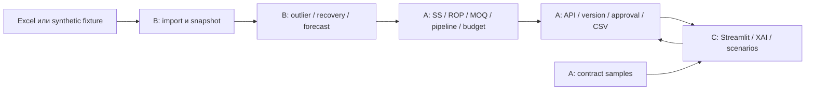

# Сильный HackAlem MVP: план на 225 минут

## 1. Решение и условия

Подтверждено пользователем: команда из трёх человек, у каждого Codex, общий GitHub-репозиторий. Пользователь отвечает за направление и решения, его Codex — за backend/интеграцию. Два других исполнителя делают данные/прогноз и UI/демо. Время, сообщённое пользователем: 2:15 → 6:00, всего 225 минут. Указанные далее часы используют эту шкалу, независимо от AM/PM. Планирование входит в эти 225 минут; разработку нельзя сдвигать на новый полный интервал после чтения документов.

Цель: работающий путь «выбрать данные → рассчитать → увидеть заказы по поставщикам → понять количество → сравнить сценарий → изменить → утвердить → скачать CSV». Покупатель сохраняет последнее решение. Никакой реальной отправки поставщикам в релизе нет.

Архитектурный фундамент уже описан в [architecture-blueprint.md](../architecture-blueprint.md), фактическая структура файлов — в [source-data-assessment.md](../source-data-assessment.md). Здесь фиксируем исполнимый релиз. Точные runtime interfaces — [contracts.md](contracts.md). Общая приёмка — [acceptance-demo.md](acceptance-demo.md).

## 2. Что обязано попасть в релиз

| Приоритет | Возможность | Как доказать готовность |
|---|---|---|
| P0 | Чтение source manifests и повторяемый snapshot | Запуск на fixture и реальных Excel, source IDs/checksums/coverage/errors видны |
| P0 | Валидные SKU/UOM и source reconciliation | Метры/штуки/упаковки не смешаны; summary rows и overlapping monthly отчёты не удваивают продажи |
| P0 | Выделение разовых крупных продаж | Detector формирует suspected_project + evidence; регулярный forecast устойчив на fixture, проекты не исчезают |
| P0 | Компенсация censored demand | На известном stockout-window demand выше raw sales; нулевые продажи при наличии не превращаются в потерянный спрос |
| P0 | Сезонность и устойчивый рост | Известный сезонный паттерн/рост воспроизводится; isolated spike не становится трендом |
| P0 | SS, ROP, target stock, dated pipeline, MOQ/multiple | Контрольные примеры проходят; late receipt не скрывает ранний дефицит; missing terms явно блокируют строку |
| P0 | Supplier proposals и XAI | Каждая единица explained, supplier totals согласованы, blocked coverage виден |
| P0 | Human review, edit/version, approve, CSV | Изменение снимает approval; unapproved export нельзя; CSV создаётся backend |
| P0 differentiator | What-if: cycle service 95/99 и задержка поставки | Один snapshot, сравнение before/after, baseline/approval не меняются |
| P0 conditional | Budget scenario | Доступен на полностью оценённом synthetic fixture; real budget недоступен без проверенных сопоставимых cost/currency |
| P0 | Offline-reproducible demo, smoke tests, README | Другой участник запускает без личных путей и supplier data; walkthrough проходит целиком |
| P1 | Editable project classification, charts polish, real subset расширение | Только после passing P0, без изменения frozen contracts |
| P2 | Freight threshold top-ups, новые модели, ERP sandbox | Только если остаётся время после готовой демонстрации; отдельное решение пользователя |

До 6:00 не строим Kubernetes, Airflow, многоскладовую сеть, реальную отправку, SSO, онлайн feature store, RAG/чат, auto tuning или физическую загрузку грузовика. Это не критерии готовности этого релиза.

## 3. Два честных режима

### Synthetic demo

Маленький полностью определённый dataset: 1 склад, 2 поставщика, 12–20 SKU, 24 месяца daily history, явные stockout-интервалы, customer pseudonyms, цены/валюта, ограничения, pipeline. Включить regular, сезонный, растущий, intermittent, one-off project, metre/coil и missing-terms SKU. Большой проект и stockout в контролируемых примерах позволяют доказать требования. Seed/as_of фиксированы. Truth labels хранятся в тестовом oracle отдельно, не передаются detector. Результаты подписаны «Демонстрация / синтетические данные».

### Real preview

Реальные IEK/Systeme Excel показывают пригодную историю, mapping, ошибочные строки, прогноз и доступные сведения. У данных нет customer IDs/точных stockout logs/всех supplier terms. Это не разрешение придумать недостающие поля. Если нужно показать полный заказ с реальной историей и предположениями — такой результат получает demo provenance. Сырые файлы не публикуются в Git и не нужны CI. Источник данных у каждого участника задаётся локальным config, образец config не содержит личных путей/секретов.

Все 12 источников регистрируются и получают статус «используется / контрольный дубликат / не применён: нужна семантика / ошибка». Читаем существующие месячные коэффициенты как source evidence, не складываем дубликаты и не подставляем текущие коэффициенты в исторический backtest. При нехватке времени рабочий real subset сначала строится по Systeme, затем IEK; граница покрытия видна. Full automated enterprise readiness не заявляется.

## 4. Технический выбор и структура

Python 3.11, FastAPI, Pydantic v2, DuckDB/Parquet для аналитики, SQLite для jobs/proposals/approvals, Streamlit, pytest. Один backend coordinator с одним process-worker для длительных вычислений; UI отдельный процесс. Задачи имеют persisted lifecycle, ошибки не теряются после перезапуска. У UI HTTP-клиент и mock provider с одной формой ответа. Redis/Celery для этого объёма не обязательны.



```text
src/ekt/contracts/         A, общая точка согласования
src/ekt/data/              B
src/ekt/forecast/          B
src/ekt/planning/          A
src/ekt/api/               A
src/ekt/storage/           A
apps/buyer_ui/             C
tests/contracts/           A
tests/planning/            A
tests/api/                 A
tests/integration/         A
tests/data/                B
tests/forecast/            B
tests/ui/                  C
tests/fixtures/            A, только synthetic
scripts/build_snapshot.py  B
scripts/profile_sources.py B
docs/demo/                 C
```

A владеет pyproject/lock/Docker/CI, shared samples и common config. Остальные передают dependency requests, не правят lock параллельно. Модули не читают файлы друг друга напрямую без общего reader/contract. Цена/валюта и quantities вычисляются backend; UI не пересчитывает округление или safety stock.

## 5. Расчётный путь

1. Import сохраняет raw provenance/checksum, нормализует SKU/UOM и вид движения. Никакого abs(quantity) для всех продаж. Повторный import тех же файлов не создаёт duplicate events; cross-export duplicates без ERP line IDs остаются известным ограничением.
2. Detector оценивает event size относительно SKU history и recurrence, customer concentration только где tokens есть. Статистический флаг — suspected, а не доказанный project. Настройка robust exclusion видна и обратима. Recurring wholesale и длительный рост не удаляются как один выброс.
3. Recovery увеличивает оценку regular demand только в известных unavailable windows. Ноль при наличии — ноль. Missing stockout data не выдаётся за отсутствие stockouts.
4. Forecast отдаёт дневной baseline, seasonal_delta, growth_delta и описанный uncertainty method. Нельзя дважды применять growth или lost demand.
5. A агрегирует forecast на L и L+R, получает ROP и SS. Предпочтительны совместные demand paths; при отсутствии используется документированный IID normal residual fallback без заявления доказанного уровня сервиса. Дневные quantiles не суммируются.
6. Netting учитывает usable stock и подходящие по дате pipeline lines. Reservations не вычитаются дважды из free stock. Project requirement и регулярный forecast не удваиваются.
7. Raw need ограничивается снизу нулём; положительный заказ округляется с MOQ и pack multiple в purchase UOM. Budget allocation может отложить целую допустимую партию или выделить разрешённое количество; не оставляет quantity ниже MOQ/не кратное pack. Показываются shortage/coverage trade-offs, optimality не заявляется.
8. XAI ledger объясняет прогноз, stock/pipeline offsets, safety, clipping, MOQ/pack, budget и manual edits. Сумма signed deltas равна displayed selected quantity.
9. Approval привязан к version/hash, проверки server-side. Любое изменение делает новый draft. CSV — единственная export-интеграция этого релиза.

## 6. Исполнители

| Исполнитель | За что отвечает | Чего от него ждут остальные |
|---|---|---|
| **A — пользователь + его Codex** | Контракты, skeleton, fixture factory, policy/ordering, backend API, persistence/approval/export, CI/integration/release | Типы и samples в первые35мин, затем живые endpoints, работающая сборка |
| **B — участник 2 + Codex** | Ingestion, quality, outlier/recovery, forecast, расчётные tests, real preview | SnapshotManifest и ForecastArtifact строго по общей схеме, reasons вместо guessed values |
| **C — участник 3 + Codex** | Streamlit, HTTP client, 3вкладки, XAI/scenario presentation, error states, demo script | UI сначала на sample responses, затем только на backend; никаких business formulas в UI |

Пользователь лично: распределяет роли, снимает бизнес-неопределённости, удерживает scope, принимает checkpoint и готовит устное объяснение. Он не должен вручную писать integration-код: исполнитель A — его Codex. Сложные вопросы о данных можно быстро пометить как unresolved/demo и продолжить независимую работу.

## 7. Общий таймлайн и зависимости

| Окно | A | B | C | Проверяемый выход |
|---|---|---|---|---|
| **2:15–2:30 / T+0–15** | План, scope, ownership, GitHub access | Читает source assessment, определяет adapters | Читает contracts, wireframe3tabs | Команда получила одинаковые задания |
| **2:30–2:50 / T+15–35** | Shared schemas, app skeleton, fixtures/sample HTTP | Малый canonical fixture adapter и baseline shape | UI на sample provider | Schemas frozen, imports/sample parsing проходят |
| **2:50–3:15 / T+35–60** | Простейший ordering/API run/SQLite | First actual forecast, preliminary real snapshot | Список supplier proposals и XAI, HTTP adapter | Первый живой end-to-end synthetic run |
| **3:15–4:00 / T+60–105** | Правильные SS/ROP/netting/MOQ, approval/edit/CSV | Outlier/recovery/season/growth + real subset | Review/approve/export UI, data flags | Сквозной обязательный бизнес-путь работает |
| **4:00–4:45 / T+105–150** | Scenarios service/delay + conditional budget | Contract tests и corrections, source coverage | Scenario comparison + project table, errors | Три differentiator доступны через live API |
| **4:45–5:20 / T+150–185** | Merge/integration, негативные cases, launch | Исправляет numerical/data bugs | Исправляет integration/UI bugs, demo script | Acceptance suite, feature freeze5:20 |
| **5:20–5:40 / T+185–205** | Fresh-clone launch, release candidate | Проверяет golden и real gaps | Полная репетиция с A | Один воспроизводимый commit + evidence |
| **5:40–6:00 / T+205–225** | Только demo-blocking fixes | Помогает защите расчётов | Финальная репетиция/backup | Демонстрация без новых фич |

Если подготовка плана заняла больше15мин, общий финиш не сдвигается. Сокращаем P1, UI polish и объём real subset. К T+60 требуется хотя бы один живой synthetic SKU end-to-end; мок не считается интеграцией. A не ждёт всей математики B, B не ждёт UI C, C не ждёт готового API благодаря sample provider.

## 8. Контрольные точки и cutline

- **T+35:** один согласованный schema/sample набор. Если нет — фиксируем минимальные типы snapshot/forecast/proposal и режем optional поля, а не пишем три несовместимых интерфейса.
- **T+60:** живой run → proposal → UI. Если нет — все прекращают новые фичи, A+B чинят boundary, C остаётся на HTTP scaffold.
- **T+105:** базовые расчёты + buyer approval/export. Если нет — отключаем P1, сложные графики и расширение реальных данных; baseline requirements не маскируем заглушкой.
- **T+150:** scenarios и project/XAI story. При нехватке времени остаются service+delay; budget работает только на complete priced fixture.
- **T+185:** feature freeze. Если что-то P0 не прошло, фиксируем честный gap в README/demo, не заявляем 100%.
- **T+205:** release freeze; допускаются только минимальные demo-blocking fixes с rerun affected smoke.

Сохраняем целостный путь и correctness. Не выбрасываем approval/versioning ради графика и не делаем притворный UI, показывающий выдуманные рекомендации вместо backend.

## 9. Backlog с зависимостями

Статус всех задач ниже — **TODO**, это план, не отчёт о реализации. `S`≈10–20мин, `M`≈20–40мин, `L`≈40–60мин agent execution; часть задач перекрывается, оценки не гарантии.

| ID | Owner | Задача | Depends | Size | Done |
|---|---|---|---|---|---|
| A01 | A | Skeleton, deps, shared schemas, fixtures | — | M | B/C могут импортировать types и samples |
| B01 | B | Inventory источников и canonical adapter | contract draft | M | Manifest, schema-valid fixture, quality errors |
| C01 | C | UI3tabs + typed mock provider | sample contract | M | Orders/detail/data screens без business logic |
| A02 | A | Policy/netting/MOQ/XAI | A01 | L | Golden108 и date/UOM cases |
| B02 | B | Detector + recovery | B01 | L | Independent spike/stockout controls |
| B03 | B | Seasonal/growth baseline + uncertainty | B01,B02 | L | ForecastArtifact с decomposition и method flags |
| A03 | A | Run jobs + proposal API/storage | A01 | M | Actual B artifact либо fixture на том же interface |
| C02 | C | HTTP integration + polling/errors | C01,A03 | M | Live run без sample fallback |
| B04 | B | Real subset + source reconciliation | B01 | M | Coverage/blocked причины, оба vendor mappings |
| A04 | A | Edit/version/approve/CSV | A02,A03 | M | Server checks, edit invalidation, duplicate export |
| C03 | C | Buyer controls + XAI | C02,A04 | M | Полный review flow, backend CSV |
| A05 | A | Scenarios service/delay/budget | A02,A03,B03 | M | Isolated replan baseline immutable |
| C04 | C | Before/after comparison + project view | C02,A05,B02 | M | Чёткие units/mode/missing data |
| B05 | B | Baseline metrics and numerical evidence | B02,B03 | S | No leakage/undefined metrics reported |
| C05 | C | Demo script и manual UI acceptance | C03,C04 | S | 5min storyline + offline backup |
| A06 | A | Integration/CI/README/release | all P0 | M | Fresh clone + acceptance + exact release SHA |

Не создавать отдельную GitHub issue на каждый tiny function. Достаточно трёх исполнительных задач с этим checklist и маленьких PR на checkpoints.

## 10. Риски и заранее выбранные решения

| Риск | Решение |
|---|---|
| Данные есть только на компьютере одного участника | Share вне Git разрешённым командным способом; UI/A работают synthetic автономно; source paths локальный config |
| Нет точных stockouts/customer IDs/lead times | Synthetic fixture + real quality flags; не объявлять эти входы наблюдаемыми |
| One-off spike перепутан с ростом | Recurrence/robust size и uncertainty; uncertain/suspected видимы, override позже |
| Ошибка join SKU/UOM или duplicate monthly data | String keys, reconciliation counts, range/source refs, failing test для metre/coil |
| Сломаны общий lock/schema | Только A merges эти файлы; sample/contract tests на каждом boundary change |
| Backend не успевает UI | C использует общий sample provider, но release обязан переключиться на live HTTP |
| Полный импорт медленный | Import один раз → immutable snapshot/Parquet; ограниченная real preview scope; per-run только расчёт |
| Budget невозможен или MOQ превышает cap | Explicit infeasible/deferred result; не округлять до недопустимой партии |
| Demo требует внешней сети | Seeded local data, installed deps, screenshots/backup и локальный запуск |
| На финале начнут corporate features | Freeze и только P0 bugfix; пользователь определяет следующее направление после релиза |

## 11. Приёмка и материалы защиты

Owner независимой сквозной проверки — A; B доказывает математику, C — реальные UI interactions. Минимум: golden arithmetic, outlier inference, no-stockout-zero control, season/growth, pipeline timing, pack/UOM, data gaps, service/delay scenarios, immutable baseline, stale approve, unapproved export, edit invalidation, actual CSV. Полная таблица [acceptance-demo.md](acceptance-demo.md).

Metrics на маленькой backtest выборке: WAPE, MASE, signed bias, coverage/undefined denominator. Нельзя суммировать метры и штуки; нельзя считать model imputation ground truth. UI показывает target service, не achieved service без независимого simulator/pilot. Финансовый эффект показываем как illustrative assumptions, не достигнутую экономию компании.

Материалы: runnable repo, README с одной проверенной launch-последовательностью, JSON/text acceptance report, demo script, input assumptions/limitations, screenshot backup, commit SHA. Ни credentials, ни сырые коммерческие выгрузки не попадают в release artifacts.

## 12. Переход после MVP

Корпоративные функции открываем только после passing release и демонстрации. Ближайший порядок: уточнить реальные source semantics → PostgreSQL и надёжные фоновые jobs → 1C sandbox adapter с idempotency → temporal backtesting/model registry → validated supplier lead times → network/MEIO. Общие contracts и отдельные domain modules позволяют менять инфраструктуру без переписывания UI и алгоритмов. Время «до6» не резервируем под этот этап.
